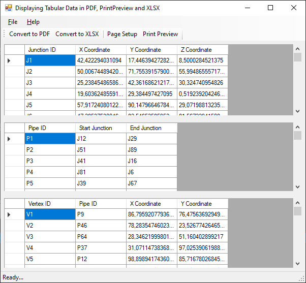
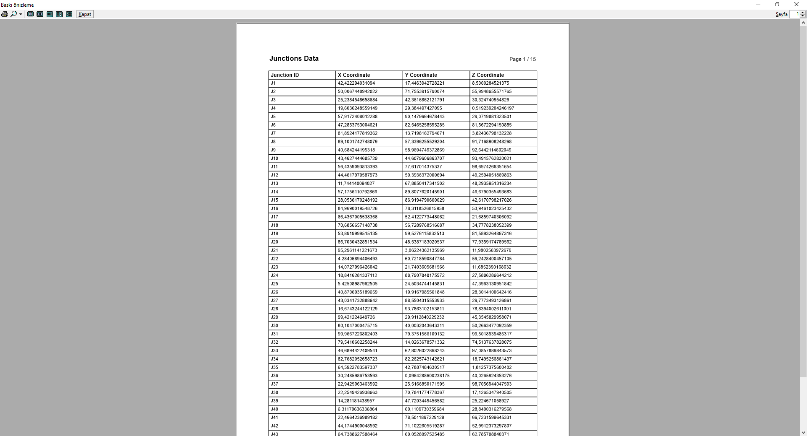
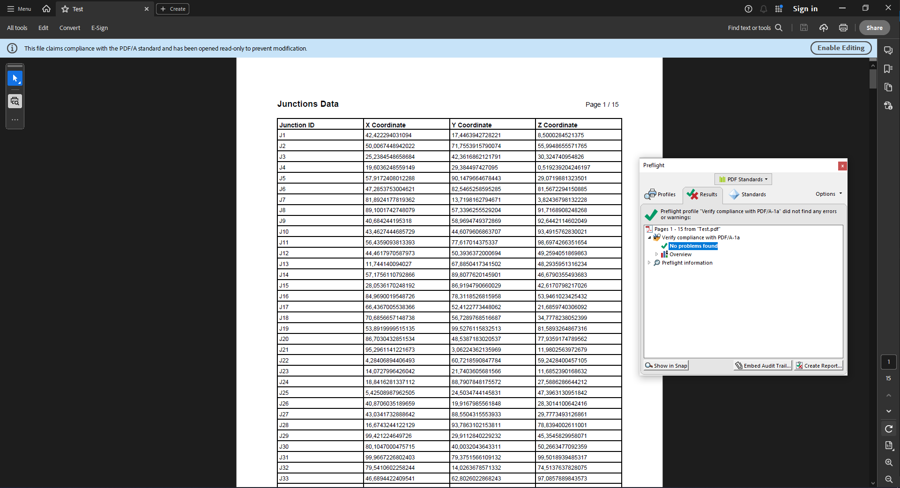
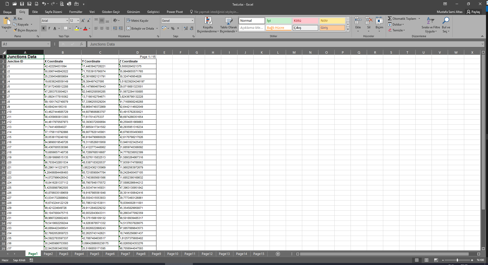

# 🚀 WYSIWYG Reports: Identical PDF, XLSX & Print Preview Output from a Single C# Codebase (Built from Scratch!)

Tired of your PDF, XLSX exports looking different from your print previews? Sick of wrestling with complex libraries just to generate a simple report? This project is the solution.

This is a C# WinForms application that demonstrates how to generate reports with a **guaranteed identical appearance** across 🖼️ **Print Preview**, 📄 **PDF**, and 📊 **XLSX** outputs. What you see is *truly* what you get.

The entire rendering pipeline is **built from scratch with zero third-party libraries**. This project serves as a powerful example of how to take full control over your document generation process.

## ✨ Key Features

*   **True WYSIWYG:** The layout, fonts, and positioning are pixel-perfect and identical across all three output formats.
*   **Zero Dependencies:** No Nuget packages, no external libraries. Just pure .NET Framework code. The PDF and XLSX writers are built from the ground up.
*   **Unified Codebase:** A single drawing logic (`DrawContent`) defines the report's appearance. No need to write separate code for PDF, Excel, and printing!
*   **Shared Page Setup:** Page settings (margins, orientation, paper size) from a single `PageSetupDialog` are respected by all export formats.
*   **PDF/A-1a Compliant PDF:** The generated PDF is a valid PDF/A-1a file, suitable for long-term archiving. It achieves this by manually building the document structure, embedding fonts, and including required metadata.
*   **Native XLSX Output:** The generated Excel file is a native Office Open XML (`.xlsx`) document, so it opens without "Compatibility Mode" warnings.

## 📸 Screenshots

<table>
  <tr>
    <td align="center">
      <b>Main Application UI</b><br>
      
    </td>
  </tr>
  <tr> 
    <td align="center">
      <b>WYSIWYG Print Preview</b><br>
      
    </td>
  </tr>
  <tr>
    <td align="center">
      <b>Identical PDF/A-1a Compliant Output</b><br>
      
    </td>
  </tr>
  <tr> 
    <td align="center">
      <b>Identical XLSX Native Format Output</b><br>
      
    </td>
  </tr>
</table>

## 🤔 How It Works: The "Capture & Replay" Method

Instead of using different logic for each format, this project uses a unified rendering pipeline built around an intermediate representation.

1.  **⚙️ Capture Phase:** A custom `GraphicsRecorder` class intercepts all GDI+ drawing commands (`DrawString`, `DrawRectangle`, etc.) and stores them as a simple list of string commands. This list acts as a "blueprint" for the report.

    ```csharp
    // Instead of drawing directly to a Graphics object...
    // e.Graphics.DrawString("Hello", ...);

    // We record the command:
    graphicsRecorder.DrawString("Hello", ...);
    // Command is stored as: "DrawString|Hello|Arial|9|Bold|100|150|1"
    ```

2.  **🎨 Replay Phase:** This "blueprint" is then passed to different renderers, each translating the commands into a specific format:
    *   **Print Preview:** Replays the commands onto the `PrintPageEventArgs.Graphics` object for a live on-screen preview.
    *   **PDF Exporter:** Parses the command list and manually constructs a PDF document from scratch. It builds all the necessary PDF objects (`/Catalog`, `/Pages`, `/Font`), embeds font data (fetched using P/Invoke calls to `gdi32.dll`), and writes the file stream byte-by-byte.
    *   **XLSX Exporter:** Also parses the command list. It creates a `.zip` archive and generates the required XML files (`workbook.xml`, `sheet.xml`, etc.) to build a valid `.xlsx` file. It meticulously translates command coordinates into Excel row heights, column widths, and cell positions to replicate the original layout.

## ✅ Feature Support

This implementation focuses on the core features needed for simple, structured reports. It is intentionally kept simple and does not support all possible GDI+ or PDF/A features.

| Feature                    | 📄 PDF         | 📊 XLSX        | 🖼️ Print Preview | Status                                             |
| -------------------------- | :------------: | :------------: | :--------------: | -------------------------------------------------- |
| **Text**                   |       ✅       |       ✅       |        ✅        | Fully supported.                                   |
| **Lines & Rectangles (Tables)** |       ✅       |       ✅       |        ✅        | Fully supported.                                   |
| **Identical Page Setup**   |       ✅       |       ✅       |        ✅        | Margins, paper size, and orientation are identical. |
| **PDF/A-1a Compliance**    |       ✅       |       --       |        --        | Basic compliance and metadata are implemented.     |
| **Images**                 |       ❌       |       ❌       |        ❌        | Not implemented.                                   |
| **Advanced PDF/A-1a Tags** |       ❌       |       --       |        --        | Complex structural/accessibility tags not implemented. |

## 💡 Why This Approach? (vs. 3rd Party Libraries)

While powerful open-source libraries like `iTextSharp`, `PdfSharp`, and `EPPlus` are fantastic, they can sometimes be:
*   **Complex:** They have a steep learning curve with a vast API.
*   **"Black Boxes":** It can be hard to understand or debug what's happening under the hood.
*   **Overkill:** For simple, precise reports, they can be more than you need.

This project offers a **lightweight, transparent, and educational alternative**. It's perfect for:
*   Learning how file formats like PDF and XLSX are structured.
*   Projects where you need absolute control over the output.
*   Situations where you want to avoid adding external dependencies.

Enjoy exploring the code.
